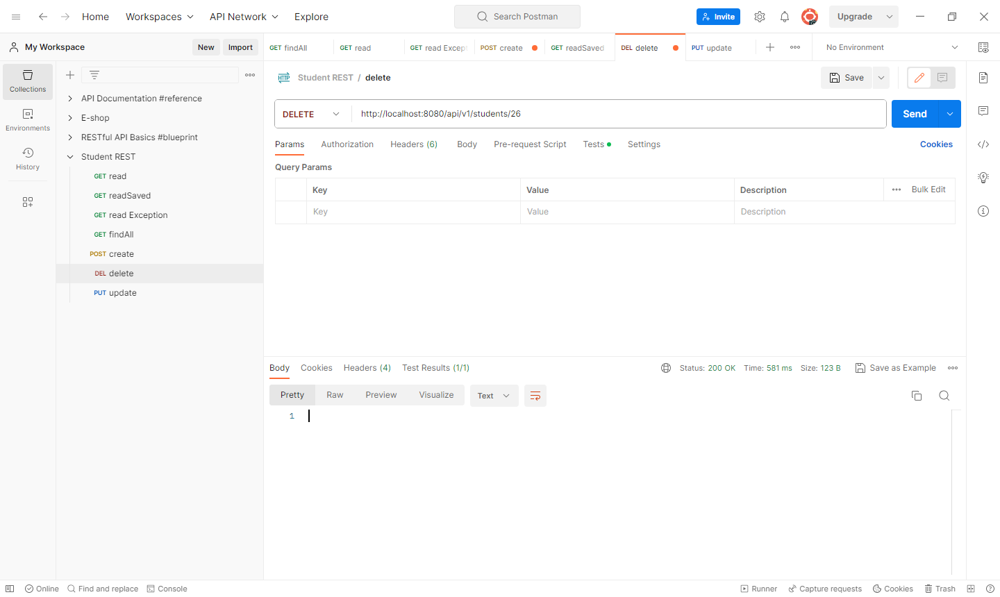

<!--suppress HtmlDeprecatedAttribute -->
<h1 align="center" id="title">Student REST API application</h1>

The Student REST API (GET, POST, PUT, DELETE operations) is a Java-based web service built with Spring framework that provides endpoints
for managing student data. It supports all HTTP methods and is scalable with multiple data sources and authentication
mechanisms. The API is secure includes error handling and logging capabilities and is easy to integrate with other systems.
It's a powerful tool for managing student data efficiently and securely.

<h2>💻 Built with</h2>

Technologies used in the project:

* spring boot
* spring data JPA
* postgreSQL
* lombok
* tomcat
* flyway
* swagger

<h2>Project Screenshots:</h2>

